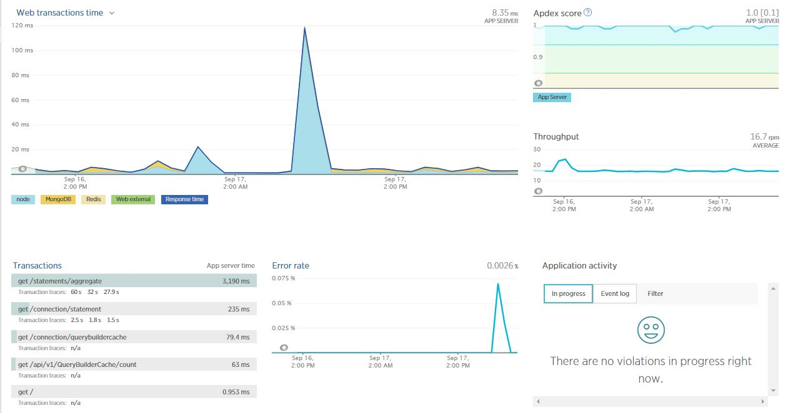

---
---

# Monitoring your LRS

## PM2 / KeyMetrics

If you have installed Learning Locker using the recommended build script, then the application will come pre-installed onto an instance of the excellent [`pm2`](http://pm2.keymetrics.io/) Node Process Management tool.

Whilst this tool can be used to monitor the running processes from within each server running LL (refer to [the documentation](http://pm2.keymetrics.io/docs/usage/monitoring/)), it can also be setup to send performance metrics to the [Key Metrics](http://docs.keymetrics.io/) platform (costs may apply).


## Logs

### Local

By default logs are captured by pm2 and stored locally on each instance as defined in the pm2 process file  ([pm2/all.json.dist](https://github.com/LearningLocker/learninglocker/blob/master/pm2/all.json.dist)). Errors and standard output are separated and can be viewed by running `pm2 logs` from within your instance. By default they are stored in `/var/log/learninglocker/` and are rotated using the [`pm2-logrotate`](https://github.com/pm2-hive/pm2-logrotate) module.


### AWS Cloudwatch
Learning Locker comes with the ability to push your logs to AWS Cloudwatch. To enable this, configure the relevant part of the `.env` files:

```
#######################
# AWS Cloudwatch logs #
# AWS credentials must be configured for Cloudwatch access
# Ref: http://docs.aws.amazon.com/AmazonCloudWatch/latest/logs/iam-identity-based-access-control-cwl.html
#######################
# Enable cloudwatch logs (false*|true)
WINSTON_CLOUDWATCH_ENABLED=
WINSTON_CLOUDWATCH_LOG_GROUP_NAME=
WINSTON_CLOUDWATCH_LOG_STREAM_NAME=
WINSTON_CLOUDWATCH_ACCESS_KEY_ID=
WINSTON_CLOUDWATCH_SECRET_ACCESS_KEY=
WINSTON_CLOUDWATCH_REGION=
```

Please note that the AWS credentials must have the required permissions to create and push to log streams/groups.


### Other logging

Learning Locker handles all logging via [Winston](https://www.npmjs.com/package/winston). New "transports" can be added and configured in both the Learning Locker application and xAPI services.


## New Relic

The Learning Locker application is configured to send performance metrics to New Relic. Simply fill in the following in the `.env` of your application instance (**note that this is currently unavailable for the xAPI service layer**)

```
#############
# New Relic #
#############

# New Relic License key
NEW_RELIC_LICENSE_KEY=
# APM name for API
NEWRELIC_API_NAME=
# APM name for UI
NEWRELIC_UI_NAME=
```



## Others

Other Node monitoring solutions are available but would need to be added manually to the script or web server.
